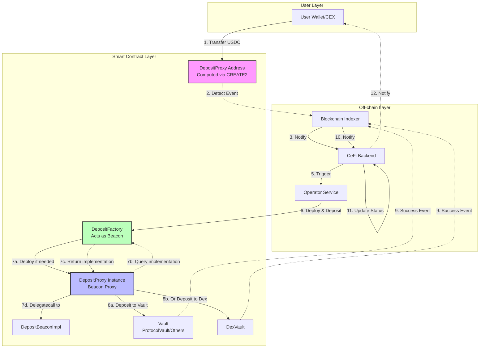
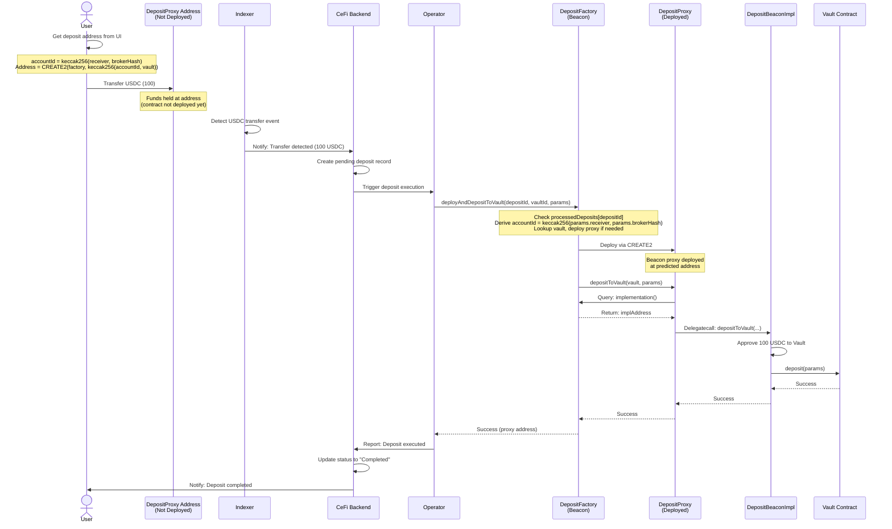
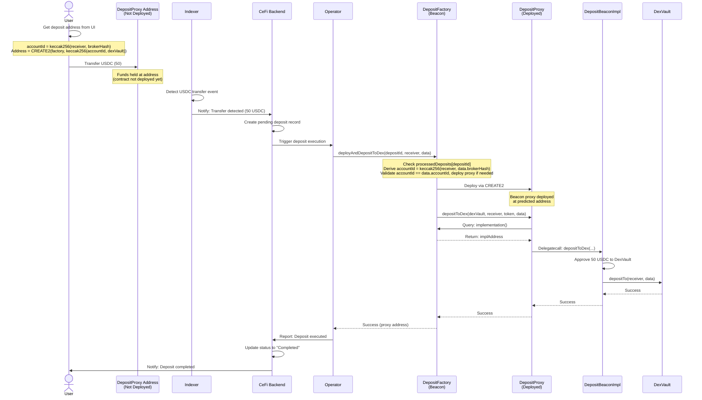
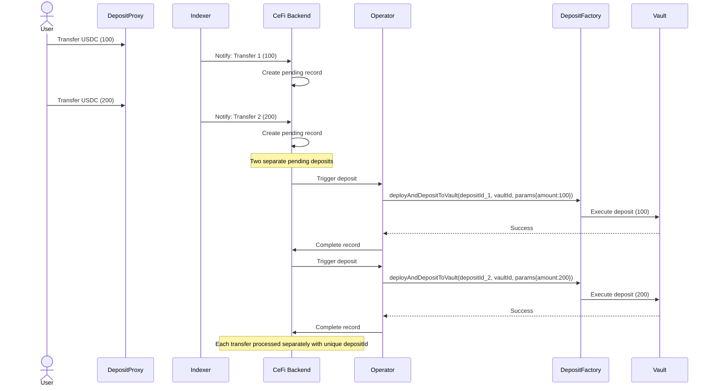
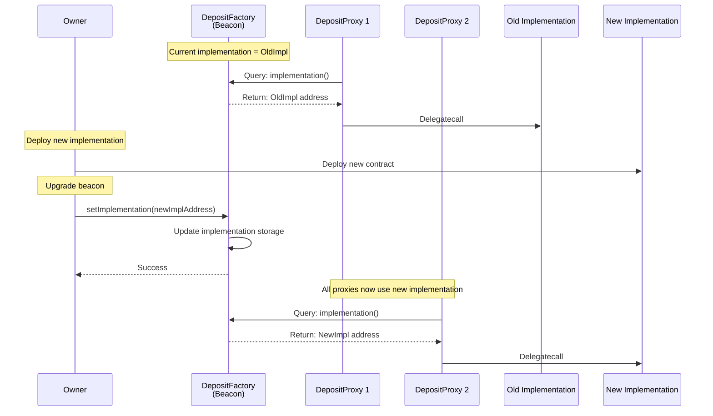

# Deposit via Address Transfer - Technical Design Document

## 1. Overview

This document describes the technical design for implementing a deposit mechanism where users can deposit USDC to Vault by simply transferring funds to a dedicated address, without needing to directly interact with the Vault smart contract.

### 1.1 Core Concept

- Each user is assigned a unique **deterministic address** (computed via CREATE2) based on their `accountId` and target `vaultAddress`
- Users transfer USDC to this address from any wallet or CEX
- An off-chain **Indexer** detects the transfer and notifies the **Operator**
- The **Operator** deploys a proxy contract (if not already deployed) and executes the deposit in a single transaction
- The proxy uses **Beacon Proxy pattern** where Factory acts as the beacon, allowing seamless upgrades

### 1.2 Key Benefits

- **User-friendly**: Users only need to transfer USDC, no smart contract interaction required
- **CEX-compatible**: Users can deposit directly from centralized exchanges
- **Deterministic**: Address can be computed before deployment based on accountId and vaultAddress
- **Gas-efficient**: Uses beacon proxy pattern to minimize deployment costs
- **Upgradeable**: All proxies can be upgraded by simply updating the implementation in the factory
- **Atomic**: Contract deployment and deposit happen in a single transaction

## 2. Architecture Overview

### 2.1 Components

```
┌─────────────┐
│    User     │
└──────┬──────┘
       │ Transfer USDC
       ▼
┌─────────────────────┐
│ DepositBeaconProxy  │ (CREATE2 Address, not yet deployed)
└──────┬──────────────┘
       │
       ▼
┌─────────────────────┐     ┌──────────────────┐
│   Indexer           │────▶│   CeFi Backend   │
│ (Off-chain)         │     └────────┬─────────┘
└─────────────────────┘              │
                                     │ Notify
                                     ▼
                              ┌──────────────┐
                              │   Operator   │
                              └──────┬───────┘
                                     │ 1. Deploy via Factory
                                     ▼
                              ┌──────────────────┐
                              │ DepositFactory   │
                              └──────┬───────────┘
                                     │ 2. Deploy Proxy
                                     ▼
                              ┌──────────────────┐
                              │DepositBeaconProxy│
                              │   (Deployed)     │
                              └──────┬───────────┘
                                     │ 3. Call deposit
                    ┌────────────────┴────────────────┐
                    ▼                                 ▼
            ┌───────────────┐              ┌──────────────┐
            │ Strategy Vault│              │   DexVault   │
            └───────────────┘              └──────────────┘
```

### 2.2 Smart Contracts

1. **DepositFactory**: Factory contract (acts as Beacon) for deploying DepositProxy contracts using CREATE2, stores the current implementation address
2. **DepositProxyImplementation**: Implementation contract that contains the logic for all proxies
3. **DepositProxy**: Beacon proxy contract (one per user per vault) that queries Factory for implementation and executes deposits

## 3. Interaction Flows

### 3.1 Complete System Flow



### 3.2 Deposit to Vault



### 3.3 Deposit to Dex 



### 3.4 Multiple Transfers Before Execution



## 4. Technical Design

### 4.1 Contract Architecture

#### 4.1.1 DepositFactory

**Responsibilities:**
- Act as Beacon: Store and provide current implementation address to all proxies
- Compute deterministic proxy addresses based on `(receiver, brokerHash, vaultAddress)`
- Deploy DepositProxy contracts using CREATE2
- Derive and validate `accountId` on-chain to prevent operator/BE tampering
- Execute deposits (with automatic deployment if needed)
- Manage operator permissions and vault registry

**Key Functions:**
```solidity
function deployAndDepositToVault(bytes32 depositId, bytes32 vaultId, DepositParams memory params) external payable onlyOperator
function deployAndDepositToDex(bytes32 depositId, address receiver, VaultDepositFE memory data) external payable onlyOperator
```

**State Variables:**
```solidity
address public implementation;                      // DepositBeaconImpl address (upgradeable)
address public dexVault;                            // DexVault address
address public operator;                            // Authorized operator (single address)
mapping(bytes32 => address) public vaults;          // vaultId => vault address mapping
mapping(address => bool) public supportedTokens;    // token => supported status
mapping(bytes32 => bool) public processedDeposits;  // depositId => processed (idempotency guard)
```

**accountId Derivation (Security Design):**

`accountId` is **never accepted from the caller**; it is always derived on-chain:

```solidity
// For Vault deposits (from DepositParams)
bytes32 accountId = keccak256(abi.encode(params.receiver, params.brokerHash));

// For Dex deposits (validated against data.accountId)
bytes32 accountId = keccak256(abi.encode(receiver, data.brokerHash));
if (accountId != data.accountId) revert InvalidAccountId();
```

This ensures that altering `receiver` automatically changes the derived `accountId` and thus the proxy address. Since the user's USDC is held in the proxy corresponding to their own `(receiver, brokerHash, vault)`, any tampering with `receiver` would redirect execution to an empty proxy, causing `InsufficientBalance` revert.

#### 4.1.2 DepositBeaconImpl

**Responsibilities:**
- Execute deposit to Vault or DexVault (logic only; USDC is held by the proxy)
- Only callable by the factory contract

**Key Functions:**
```solidity
function depositToVault(
    address vault,
    DepositParams memory params
) external payable onlyFactory

function depositToDex(
    address dexVault,
    address receiver,
    address token,
    VaultDepositFE memory data
) external payable onlyFactory

```

**State Variables:**
```solidity
address public immutable FACTORY;  // Factory address (set in constructor)
```

#### 4.1.3 DepositProxy (Beacon Proxy)

- Deployed via OpenZeppelin's `BeaconProxy` pattern
- Holds user's USDC temporarily (deterministic CREATE2 address is the transfer target)
- Queries Factory for current implementation address on each call
- Delegates all calls to DepositBeaconImpl
- Automatically uses updated implementation when factory's implementation is upgraded

### 4.2 CREATE2 Address Calculation

```solidity
// accountId is derived from receiver and brokerHash
bytes32 accountId = keccak256(abi.encode(receiver, brokerHash));

// Salt is computed from accountId and vaultAddress
bytes32 salt = keccak256(abi.encodePacked(accountId, vaultAddress));

// Beacon proxy bytecode (OpenZeppelin BeaconProxy)
bytes memory bytecode = abi.encodePacked(
    type(BeaconProxy).creationCode,
    abi.encode(factoryAddress, "") // beacon = factory, no init data
);

// Compute CREATE2 address
address predictedAddress = address(uint160(uint256(keccak256(abi.encodePacked(
    bytes1(0xff),
    factoryAddress,
    salt,
    keccak256(bytecode)
)))));
```

**Note**: The salt includes both `accountId` (which encodes receiver + brokerHash) and `vaultAddress`, meaning:
- Each `(receiver, brokerHash, vault)` triple maps to exactly one deposit address
- Same user depositing to different vaults will have different addresses
- Address is fully deterministic and can be precomputed off-chain

### 4.3 Deposit Flow Details

#### 4.3.1 Deposit to Vault (ProtocolVault or other registered vaults)

Used for LP deposits through registered vault contracts.

**Interface:**
```solidity
function deployAndDepositToVault(
    bytes32 depositId,
    bytes32 vaultId,
    DepositParams memory params
) external payable onlyOperator returns (address proxy)
```

**Parameters:**
```solidity
struct DepositParams {
    PayloadType payloadType;  // LP_DEPOSIT or SP_DEPOSIT
    address receiver;          // User's receiving address (used to derive accountId)
    address token;             // USDC token address
    uint256 amount;            // Deposit amount
    bytes32 brokerHash;        // Broker identifier (used to derive accountId)
}
```

**Execution Steps:**
1. Revert with `DepositAlreadyProcessed` if `processedDeposits[depositId]` is true
2. Mark `processedDeposits[depositId] = true`
3. Validate `params.token` is in `supportedTokens`
4. Look up vault address from `vaults[vaultId]`; revert with `VaultNotRegistered` if not found
5. Derive `accountId = keccak256(abi.encode(params.receiver, params.brokerHash))`
6. Deploy proxy via `CREATE2` if not already deployed
7. Check proxy's token balance ≥ `params.amount`; revert with `InsufficientBalance` if not
8. Call `proxy.depositToVault(vault, params)` forwarding `msg.value`

**Vault Interface:**
```solidity
function deposit(DepositParams memory depositParams) external payable;
```

#### 4.3.2 Deposit to Dex (DexVault)

Used for direct deposits to DexVault for trading.

**Interface:**
```solidity
function deployAndDepositToDex(
    bytes32 depositId,
    address receiver,
    VaultDepositFE memory data
) external payable onlyOperator returns (address proxy)
```

**Parameters:**
```solidity
struct VaultDepositFE {
    bytes32 accountId;   // Must equal keccak256(abi.encode(receiver, brokerHash))
    bytes32 brokerHash;  // Broker identifier (used to derive and validate accountId)
    bytes32 tokenHash;   // Token identifier (USDC hash)
    uint128 tokenAmount; // Deposit amount
}
```

**Execution Steps:**
1. Revert with `DepositAlreadyProcessed` if `processedDeposits[depositId]` is true
2. Mark `processedDeposits[depositId] = true`
3. Derive `accountId = keccak256(abi.encode(receiver, data.brokerHash))`
4. Revert with `InvalidAccountId` if derived `accountId != data.accountId`
5. Resolve token address from `data.tokenHash`; revert with `TokenNotSupported` if not found
6. Deploy proxy via `CREATE2` (salt uses `dexVault` address) if not already deployed
7. Check proxy's token balance ≥ `data.tokenAmount`; revert with `InsufficientBalance` if not
8. Call `proxy.depositToDex(dexVault, receiver, token, data)` forwarding `msg.value`

**DexVault Interface:**
```solidity
function depositTo(address receiver, VaultDepositFE calldata data) external payable;
```

### 4.4 Cross-Chain Gas Fee

Before calling a deposit method, the Operator must estimate the cross-chain gas fee:

```solidity
// For Vault deposits
function quoteOperation(PayloadType payloadType, address receiver, uint256 amount) public view returns (uint256);

// For Dex deposits
function getDepositFee(address receiver, VaultDepositFE calldata data) external view returns (uint256);
```

The fee is passed as `msg.value` on the deposit call. It is not stored in the contract to keep proxy balances observable (only USDC should appear in a proxy's balance).

### 4.5 Idempotency — depositId

Every deposit execution carries a unique `depositId` derived **off-chain** by the Indexer from the on-chain transfer event:

```
depositId = keccak256(abi.encodePacked(transferTxHash, logIndex))
```

The Factory maintains a single mapping:

```solidity
mapping(bytes32 => bool) public processedDeposits;
```

On each call the Factory:
1. Checks `processedDeposits[depositId]` — if `true`, reverts with `DepositAlreadyProcessed(depositId)`
2. Sets `processedDeposits[depositId] = true` **before** any external calls (checks-effects-interactions)
3. Proceeds with deploy + deposit

This guarantees that:
- Operator retry loops cannot double-spend the same transfer
- A new transfer that happens to arrive at the same proxy before the first one is settled is still safe — it will carry a **different** `depositId` (different `txHash`)
- No extra on-chain computation needed; the key is supplied by the caller

## 5. Security Considerations

### 5.1 Access Control

1. **Operator Permissions**
   - Only the authorized operator can trigger deployments and deposits

2. **Proxy Security**
   - Proxies can only be called by the factory contract
   - `onlyFactory` modifier on all sensitive functions
   - `FACTORY` address is immutable in implementation (`address public immutable FACTORY`)

3. **accountId On-chain Derivation (Operator Tamper-proof)**
   - `accountId` is **never accepted as a parameter from the caller**; it is always derived on-chain from `(receiver, brokerHash)`
   - Changing `receiver` automatically changes `accountId` and thus the target proxy address
   - Since the user's USDC sits in the proxy bound to their own `receiver`, any receiver tampering causes the execution to target an empty proxy, resulting in `InsufficientBalance` revert
   - For Dex deposits, `data.accountId` is additionally validated against the derived value: `if (accountId != data.accountId) revert InvalidAccountId()`

### 5.2 Fund Safety

1. **Atomic Operations**
   - Deploy and deposit happen in a single transaction
   - If deposit fails, entire transaction reverts
   - No state where funds are stuck in proxy

2. **Emergency Withdrawal**
   - Factory includes `emergencyWithdraw` function
   - Only owner can call in case of emergency
   - Can rescue funds from any deployed proxy

3. **Reentrancy Protection**
   - Implementation uses `nonReentrant` modifier
   - Token approvals are set to zero after each deposit
   - Follows checks-effects-interactions pattern

### 5.3 Proxy Upgrade Process

#### Beacon Proxy Upgrade Flow

Since all DepositProxy contracts query the Factory for the current implementation address, upgrading is straightforward:



#### Upgrade Steps

1. **Deploy New Implementation**
   ```solidity
   DepositBeaconImpl newImpl = new DepositBeaconImpl(factory);
   ```

2. **Test New Implementation**
   - Deploy test proxy on testnet
   - Verify all functions work correctly
   - Check gas costs are acceptable
   - Ensure backward compatibility

3. **Upgrade Factory's Implementation**
   ```solidity
   factory.setImplementation(address(newImpl));
   ```

4. **Verification**
   - All existing proxies immediately use new implementation
   - No need to upgrade individual proxies
   - Monitor for any issues

#### Upgrade Considerations

1. **Implementation Compatibility**
   - New implementation must maintain the same storage layout
   - Cannot change the factory address (immutable)
   - Must preserve all existing function selectors
   - Can add new functions safely

2. **Gradual Rollout**
   - Test on a single proxy first
   - Monitor for 24-48 hours
   - If successful, upgrade factory's beacon
   - All proxies automatically upgraded

3. **Emergency Rollback**
   ```solidity
   factory.setImplementation(address(oldImpl));
   ```
   - Can instantly rollback to previous implementation
   - No impact on user funds
   - All proxies revert to old implementation immediately

---

## 6. Operator & Indexer Integration Reference

### 6.1 Operator — Methods to Call

The Operator is the only address authorised to trigger deposit execution on `DepositFactory`. It must call one of the two methods below depending on the deposit destination.

#### `deployAndDepositToVault`

Used when the user's funds should be deposited into a registered Vault (e.g. ProtocolVault).

```solidity
function deployAndDepositToVault(
    bytes32 depositId,    // keccak256(abi.encodePacked(transferTxHash, logIndex))
    bytes32 vaultId,      // Registered vault identifier
    DepositParams memory params
) external payable returns (address proxy);

struct DepositParams {
    PayloadType payloadType;  // LP_DEPOSIT or SP_DEPOSIT
    address receiver;          // User's receiving address (used to derive accountId on-chain)
    address token;             // USDC token address
    uint256 amount;            // Expected deposit amount (must be ≤ proxy token balance)
    bytes32 brokerHash;        // Broker identifier (used to derive accountId on-chain)
}
```

**Notes:**
- `msg.value` must cover the cross-chain gas fee (query `vault.quoteOperation(payloadType, receiver, amount)` beforehand)

#### `deployAndDepositToDex`

Used when the user's funds should be deposited directly into DexVault for trading.

```solidity
function deployAndDepositToDex(
    bytes32 depositId,        // keccak256(abi.encodePacked(transferTxHash, logIndex))
    address receiver,          // User's on-chain receiving address
    VaultDepositFE memory data
) external payable returns (address proxy);

struct VaultDepositFE {
    bytes32 accountId;   // Must equal keccak256(abi.encode(receiver, brokerHash)) — validated on-chain
    bytes32 brokerHash;  // Broker identifier
    bytes32 tokenHash;   // Token identifier (e.g. keccak256("USDC"))
    uint128 tokenAmount; // Expected deposit amount
}
```

**Notes:**
- `msg.value` must cover the cross-chain gas fee (query `dexVault.getDepositFee(receiver, data)` beforehand)
---

### 6.2 Indexer

The Indexer must monitor two on-chain events emitted by `DepositFactory` to confirm that an operator-triggered deposit was executed successfully.

#### `DepositToVault`

```solidity
event DepositToVault(bytes32 depositId);
```

Emitted at the end of a successful `deployAndDepositToVault` call.

| Field | Type | Description |
|---|---|---|
| `depositId` | `bytes32` | Unique deposit ID, matches the one submitted by the Operator |

**Action:** Mark the corresponding pending deposit record as **Completed** and notify the user.

#### `DepositToDex`

```solidity
event DepositToDex(bytes32 depositId);
```

Emitted at the end of a successful `deployAndDepositToDex` call.

| Field | Type | Description |
|---|---|---|
| `depositId` | `bytes32` | Unique deposit ID, matches the one submitted by the Operator |

**Action:** Mark the corresponding pending deposit record as **Completed** and notify the user.

---


Key properties:
- `depositId` is the canonical link between an on-chain USDC transfer and its deposit execution
- A `depositId` can only ever be processed once (`processedDeposits[depositId]` mapping)
- If the Operator retries a call with the same `depositId`, the factory reverts — no double-spend
