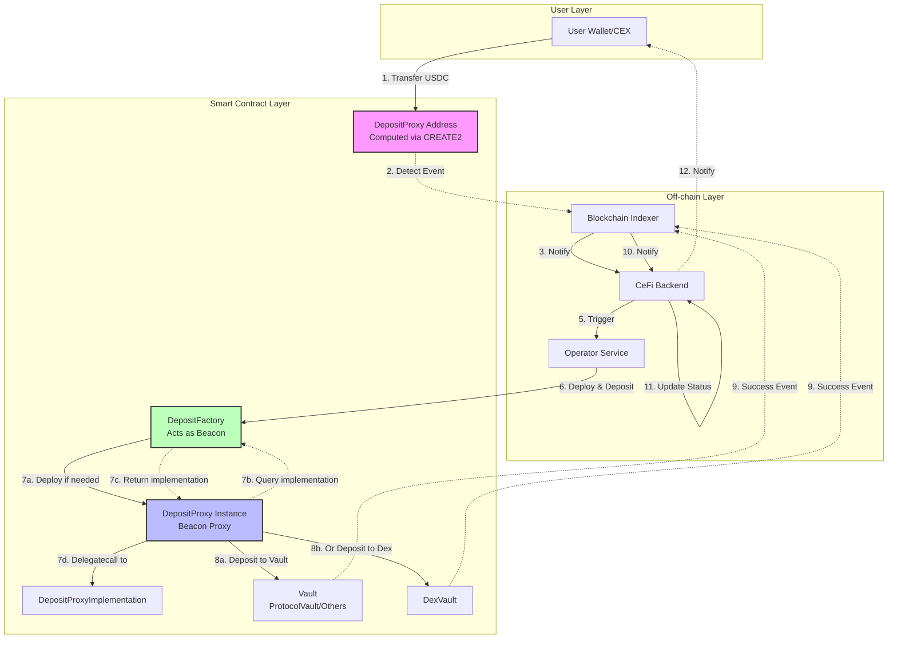
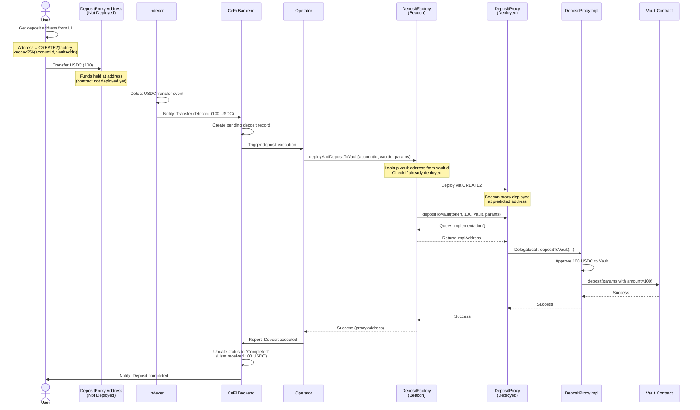
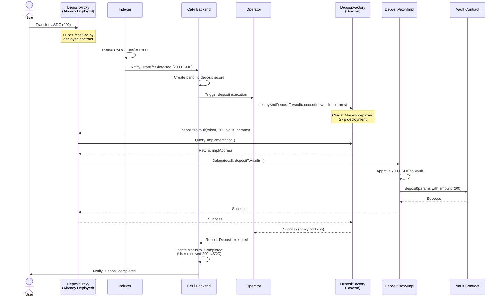
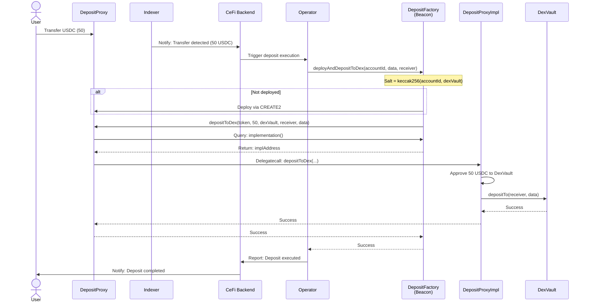
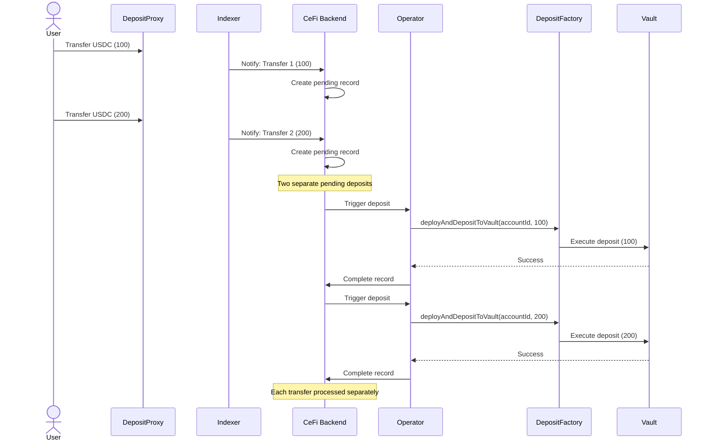
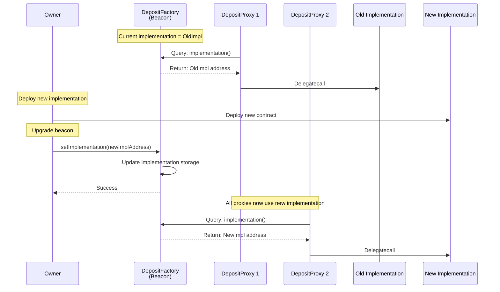

# Deposit via Address Transfer - Technical Design Document

## 1. Overview

This document describes the technical design for implementing a deposit mechanism where users can deposit USDC to Vault by simply transferring funds to a dedicated address, without needing to directly interact with the Vault smart contract.

### 1.1 Core Concept

- Each user is assigned a unique **deterministic address** (computed via CREATE2) based on their `accountId` and target `vaultAddress`
- Users transfer USDC to this address from any wallet or CEX
- An off-chain **Indexer** detects the transfer and notifies the **Operator**
- The **Operator** deploys a proxy contract (if not already deployed) and executes the deposit in a single transaction
- The proxy uses **Beacon Proxy pattern** where Factory acts as the beacon, allowing seamless upgrades

### 1.2 Key Benefits

- **User-friendly**: Users only need to transfer USDC, no smart contract interaction required
- **CEX-compatible**: Users can deposit directly from centralized exchanges
- **Deterministic**: Address can be computed before deployment based on accountId and vaultAddress
- **Gas-efficient**: Uses beacon proxy pattern to minimize deployment costs
- **Upgradeable**: All proxies can be upgraded by simply updating the implementation in the factory
- **Atomic**: Contract deployment and deposit happen in a single transaction

## 2. Architecture Overview

### 2.1 Components

```
┌─────────────┐
│    User     │
└──────┬──────┘
       │ Transfer USDC
       ▼
┌─────────────────────┐
│ DepositProxy        │ (CREATE2 Address, not yet deployed)
│ (Minimal Proxy)     │
└──────┬──────────────┘
       │
       ▼
┌─────────────────────┐     ┌──────────────────┐
│   Indexer           │────▶│   CeFi Backend   │
│ (Off-chain)         │     └────────┬─────────┘
└─────────────────────┘              │
                                     │ Notify
                                     ▼
                              ┌──────────────┐
                              │   Operator   │
                              └──────┬───────┘
                                     │ 1. Deploy via Factory
                                     ▼
                              ┌──────────────────┐
                              │ DepositFactory   │
                              └──────┬───────────┘
                                     │ 2. Deploy Proxy
                                     ▼
                              ┌──────────────────┐
                              │  DepositProxy    │
                              │   (Deployed)     │
                              └──────┬───────────┘
                                     │ 3. Call deposit
                    ┌────────────────┴────────────────┐
                    ▼                                 ▼
            ┌───────────────┐              ┌──────────────┐
            │ ProtocolVault │              │   DexVault   │
            └───────────────┘              └──────────────┘
```

### 2.2 Smart Contracts

1. **DepositFactory**: Factory contract (acts as Beacon) for deploying DepositProxy contracts using CREATE2, stores the current implementation address
2. **DepositProxyImplementation**: Implementation contract that contains the logic for all proxies
3. **DepositProxy**: Beacon proxy contract (one per user per vault) that queries Factory for implementation and executes deposits

## 3. Technical Design

### 3.1 Contract Architecture

#### 3.1.1 DepositFactory

**Responsibilities:**
- Act as Beacon: Store and provide current implementation address to all proxies
- Compute deterministic addresses for users based on `accountId` and `vaultAddress`
- Deploy DepositProxy contracts using CREATE2
- Execute deposits (with automatic deployment if needed)
- Manage operator permissions and vault registry

**Key Functions:**
```solidity
function getDepositAddress(bytes32 accountId, address vaultAddress) external view returns (address)
function deployAndDepositToVault(bytes32 accountId, bytes32 vaultId, DepositParams memory params) external onlyOperator
function deployAndDepositToDex(bytes32 accountId, VaultDepositFE memory data, address receiver) external payable onlyOperator
function isDeployed(bytes32 accountId, address vaultAddress) external view returns (bool)
function implementation() external view returns (address)  // Beacon interface
function setImplementation(address newImpl) external onlyOwner
function registerVault(bytes32 vaultId, address vaultAddress) external onlyOwner
```

**State Variables:**
```solidity
address public implementation;                          // DepositProxyImplementation address (upgradeable)
address public dexVault;                                // DexVault address
address public operator;                                // Authorized operator (single address)
mapping(bytes32 => address) public vaults;              // vaultId => vault address mapping
mapping(bytes32 => mapping(address => bool)) public deployed;  // accountId => vaultAddress => deployed status
```

#### 3.1.2 DepositProxyImplementation

**Responsibilities:**
- Hold user's USDC temporarily
- Execute deposit to Vault or DexVault
- Only callable by factory contract

**Key Functions:**
```solidity
function depositToVault(
    address token,
    uint256 amount,
    address vault,
    DepositParams memory params
) external onlyFactory

function depositToDex(
    address token,
    uint256 amount,
    address dexVault,
    address receiver,
    VaultDepositFE memory data
) external payable onlyFactory

function withdraw(address token, address to, uint256 amount) external onlyFactory
```

**State Variables:**
```solidity
address public immutable factory;  // Factory address (set in constructor)
```

#### 3.1.3 DepositProxy (Beacon Proxy)

- Deployed via custom beacon proxy pattern
- Queries Factory for current implementation address on each call
- Delegates all calls to DepositProxyImplementation
- Address computed as: `CREATE2(factory, salt=keccak256(accountId, vaultAddress), initCode)`
- Automatically uses updated implementation when factory's implementation is upgraded

### 3.2 CREATE2 Address Calculation

```solidity
// Salt is computed from accountId and vaultAddress
bytes32 salt = keccak256(abi.encodePacked(accountId, vaultAddress));

// Beacon proxy bytecode (queries factory for implementation)
bytes memory bytecode = abi.encodePacked(
    // Store factory address
    hex"73",                          // PUSH20
    factory,                           // Factory address (20 bytes)
    hex"3d3d3d3d363d3d37363d73",       // Beacon proxy initialization
    hex"5af43d3d93803e602a57fd5bf3"   // DELEGATECALL logic
);

// Compute CREATE2 address
address predictedAddress = address(uint160(uint256(keccak256(abi.encodePacked(
    bytes1(0xff),
    factory,
    salt,
    keccak256(bytecode)
)))));
```

**Note**: The salt includes both `accountId` and `vaultAddress`, meaning:
- Each user can have multiple deposit addresses (one per vault)
- Same user depositing to different vaults will have different addresses
- Address is deterministic and can be precomputed

### 3.3 Deposit Flow Types

#### 3.3.1 Deposit to Vault (ProtocolVault or other registered vaults)

Used for LP/SP deposits through registered vault contracts.

**Interface:**
```solidity
function deployAndDepositToVault(
    bytes32 accountId,
    bytes32 vaultId,
    DepositParams memory params
) external onlyOperator returns (address proxy)
```

**Parameters:**
```solidity
struct DepositParams {
    PayloadType payloadType;  // LP_DEPOSIT or SP_DEPOSIT
    address receiver;          // User's receiving address
    address token;             // USDC token address
    uint256 amount;            // Deposit amount (before fee deduction)
    bytes32 brokerHash;        // Broker identifier
}
```

**Flow:**
1. Operator calls `deployAndDepositToVault` with vaultId
2. Factory looks up vault address from `vaults[vaultId]`
3. Factory deploys proxy (if needed) using `CREATE2(salt=keccak256(accountId, vaultAddress))`
4. Factory calls proxy's `depositToVault`
5. Proxy approves and calls `vault.deposit(params)` with full amount

**Vault Interface:**
```solidity
function deposit(DepositParams memory depositParams) external payable;
```

#### 3.3.2 Deposit to Dex (DexVault)

Used for direct deposits to DexVault for trading.

**Interface:**
```solidity
function deployAndDepositToDex(
    bytes32 accountId,
    VaultDepositFE memory data,
    address receiver
) external payable onlyOperator returns (address proxy)
```

**Parameters:**
```solidity
struct VaultDepositFE {
    bytes32 accountId;   // User account ID
    bytes32 brokerHash;  // Broker identifier
    bytes32 tokenHash;   // Token identifier (USDC hash)
    uint128 tokenAmount; // Deposit amount (before fee deduction)
}
```

**Flow:**
1. Operator calls `deployAndDepositToDex` with deposit data
2. Factory deploys proxy (if needed) using `CREATE2(salt=keccak256(accountId, dexVault))`
3. Factory calls proxy's `depositToDex`
4. Proxy approves and calls `dexVault.depositTo(receiver, data)` with full amount

**DexVault Interface:**
```solidity
function depositTo(address receiver, VaultDepositFE calldata data) external payable;
```

### 3.4 Cross Chain Gas Fee

Before Operator call deposit method, estimate gas fee need to be called to get the cross chain gas fee. 
For the vault
```solidity
function quoteOperation(PayloadType payloadType, address receiver, uint256 amount) public view returns (uint256);
```
For the dex 
```solidity
function getDepositFee(address receiver, VaultDepositFE calldata data) external view returns (uint256);
```
Operator call with value instead of store in contract beacuse we still need to monitor all beaconproxy contract balance status.

## 4. Interaction Flows

### 4.1 Complete System Flow



### 4.2 First Deposit (Contract Not Deployed)



### 4.3 Subsequent Deposit (Contract Already Deployed)



### 4.4 Deposit to Dex Flow



### 4.5 Multiple Transfers Before Execution



## 5. Security Considerations

### 5.1 Access Control

1. **Operator Permissions**
   - Only the authorized operator can trigger deployments and deposits

2. **Proxy Security**
   - Proxies can only be called by the factory contract
   - `onlyFactory` modifier on all sensitive functions
   - Factory address is immutable in implementation

3. **accountId Validation**
   - Each accountId maps to exactly one address (deterministic)
   - No risk of collision due to CREATE2 properties
   - Operator should validate accountId off-chain before execution

### 5.2 Fund Safety

1. **Atomic Operations**
   - Deploy and deposit happen in a single transaction
   - If deposit fails, entire transaction reverts
   - No state where funds are stuck in proxy

2. **Emergency Withdrawal**
   - Factory includes `emergencyWithdraw` function
   - Only owner can call in case of emergency
   - Can rescue funds from any deployed proxy

3. **Reentrancy Protection**
   - Implementation uses `nonReentrant` modifier
   - Token approvals are set to zero after each deposit
   - Follows checks-effects-interactions pattern

### 5.3 Proxy Upgrade Process

#### Beacon Proxy Upgrade Flow

Since all DepositProxy contracts query the Factory for the current implementation address, upgrading is straightforward:



#### Upgrade Steps

1. **Deploy New Implementation**
   ```solidity
   DepositProxyImplementation newImpl = new DepositProxyImplementation(factory);
   ```

2. **Test New Implementation**
   - Deploy test proxy on testnet
   - Verify all functions work correctly
   - Check gas costs are acceptable
   - Ensure backward compatibility

3. **Upgrade Factory's Implementation**
   ```solidity
   factory.setImplementation(address(newImpl));
   ```

4. **Verification**
   - All existing proxies immediately use new implementation
   - No need to upgrade individual proxies
   - Monitor for any issues

#### Upgrade Considerations

1. **Implementation Compatibility**
   - New implementation must maintain the same storage layout
   - Cannot change the factory address (immutable)
   - Must preserve all existing function selectors
   - Can add new functions safely

2. **Gradual Rollout**
   - Test on a single proxy first
   - Monitor for 24-48 hours
   - If successful, upgrade factory's beacon
   - All proxies automatically upgraded

3. **Emergency Rollback**
   ```solidity
   factory.setImplementation(address(oldImpl));
   ```
   - Can instantly rollback to previous implementation
   - No impact on user funds
   - All proxies revert to old implementation immediately
---
